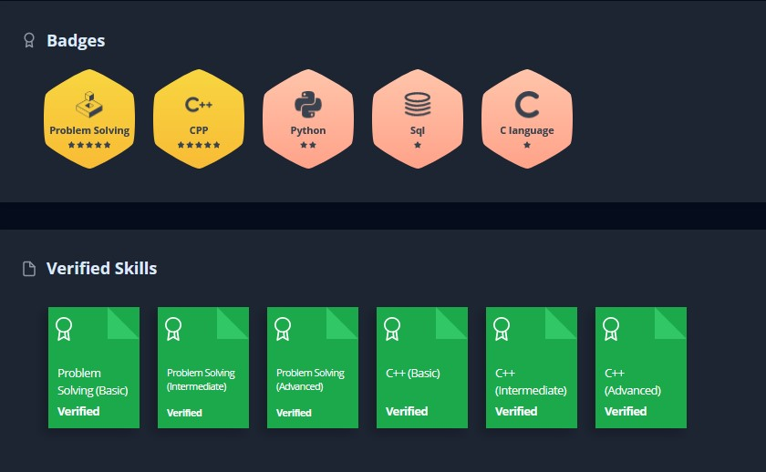

<!--
**kumarvoman/kumarvoman** is a ✨ _special_ ✨ repository because its `README.md` (this file) appears on your GitHub profile.

--->


## Hi 👋, I'm a software engineer working in Bengaluru, Karnataka, India
I code, so people can work from anywhere.
<p align="left">
  <a href="https://leetcode.com/kumarvoman/">
    
  </a>
  <!------
  <a href="https://hackerrank.com/profile/kumarvoman">
    
  </a>
-->
  <a href="[https://stackoverflow.com/users/5921662/sudipto](https://stackoverflow.com/users/7059433/voman-kumar)">
    
  </a>
  <a href="https://github.com/kumarvoman?tab=followers">
    
  </a>

  <a href="https://github.com/milaan9/milaan9/pulse" alt="Activity">
      
  </a>

  <a href="https://github.com/kumarvoman/">
    
  </a>

</p>


<!--
- ✨ Contributing to [LoadBalancer](https://github.com/chkware/cli);
-->
- :fire: Experienced in Backend Development and System Design (A Decade and going on, into Networking and Application);
- :calendar: Open for contributing to exciting open source projects
- ⛄ Always working on something creative, Always learning

#### Quick Info

```javascript
var Voman = {
  Pronouns: "He" | "him",
  Always learning Something: True,
  Can fluently Code: [C++14/17, NodeJS, C#, Java, Python, VB6.0],
  Tools: [Visual Studio, Git, Docker],
  Database: [MSSQL, MongoDB, Oracle, MS Access]
  OS: [Windows]
  Projects currently working on: [Building something new - Coming soon]
  Tech Stack currently learning : [React, Game design]
  Architecture: ["WIN32", "microservices", "event-driven", "System Design", "ZTNA"],
  Networking protocols: [TCP, UDP, DNS, SMB, HTTP/HTTPS, SMTP, TOTP, TLS]
  Challenge: This year(2025) is focused on myself after a slow start, Learning Calisthenics, and Preparing for a full marathon.
  Achievements: ["Finished 52 Books a year challenge in 2021"],
  SuperPower: ["can sleep for straight 26 hours", "Can run a half marathon any day"]
}
```

#### Bio

- 🏢 I'm currently working at **Ivanti - Senior Software Engineer R&D**
- ⚙️ I use daily: `.cpp`, `.bat`, `.mak`, `.sh`
- 🌍 I'm mostly active within the **C++ Community**
- 🌱 Learning about **Scalable Systems**
- 💬 Ping me about **Modern C++**, **DSA**, **Docker**, **RestAPIs**, **Distributed systems**
- 📫 Reach me: kumarvoman@gmail.com
- 📝 Checkout my [Resume](files/VomanKumar-CppCoder.pdf).
- Checkout my [LeetCode](https://leetcode.com/kumarvoman/)


<!--
#### Development Stuffs:

<b>⚡ Github Stats</b>
<p float="left">
 

 
</p>
 <br/>
<b>&#128200; Competitive Programming</b>
<p float="left">


</p>
-->
#### Connect With Me

<p left="center">
<a href="https://twitter.com/vomankumar/">
  
</a> 
<a href="https://www.linkedin.com/in/kumarvoman/">
  
</a> 
<a href="https://www.facebook.com/voman.kumar/">
  
</a>
<a href="https://medium.com/@vomankumar">
  
</a>
</p>

 <em><b>I love connecting with different people</b> so if you want to say <b>hi, I'll be happy to meet you more!</b> :)</em>
  
  <!--
  <a href="https://github.com/kumarvoman/Threadpool">
  
</a>
<a href="https://github.com/anuraghazra/LoadBalancer">
  
</a> 

Learning from : https://github.com/anuraghazra/github-readme-stats

-->

